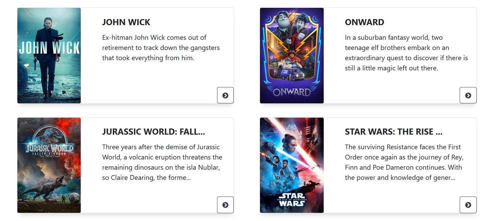
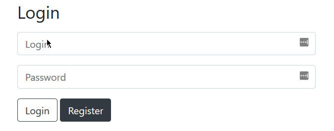
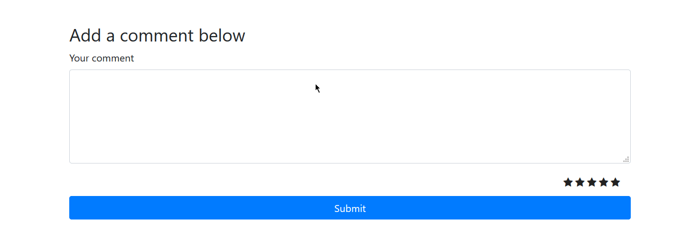

<br>

# **PROJET FILMOTEC**

Application à but de référencement des films actuellement au cinéma, en s'appuyant sur l'API de TMDB ainsi qu'une API propriétaire. Il est possible pour un groupe d'utilisateur choisi de noter ces films et laisser une appréciation en commentaire.


<br>

### **Auteurs**

Yahia Lamri - Stanislas Raczynski

### **Etat du projet**

Completed - Rapport dans `public > docs`


## **Description**

L'application doit être en mesure d'afficher un liste de films récupérer grâce à l'API de TMDB (themoviedb.org) par l'intermédiaire d'une api propriétaire. Elle devra également proposer aux utilisateurs de rajouter un commentaire ainsi qu'une note d'évaluation. 
Ces données ensuite transmise à une base de données Mongodb, devront être affichés. Ainsi, pour chaque films ayant déjà été noté, l'application doit être en mesure de générer un récapitulatif de ce dernier (meilleur et pire commentaire avec note associées, ainsi que la note moyenne).


## **Installation (require Mongodb)**

1.  ```$ > git clone https://github.com/Awuzi/filmotec/```
2.  ```$ > npm i```
3.  ```$ > nodemon -e twig, js```

Mongodb :

- Linux : ```$ > sudo apt install mongodb```
- Windows : <a href="https://www.mongodb.com/download-center/community" target="_blank">donwload here</a>

## **Utilisation**

<p align="center">
  
</p>

En premier lieu, l'utilisateur accède à la page d'accueil, où trois choix lui sont proposés : La page de login, l'accès à la liste des films proposés (ApNotPan), et à la liste des films les mieux notés par les utilisateurs (ApMagWeb). 
Si l'utlisateur souhaite s'identifier ou s'enregistrer, la page Login lui permet de faire ces deux actions.

<p align="center">
  
</p>

ApNotPan propose une liste de films sur lesquels les utilisateurs inscrits et connectés peuvent laisser leur avis via une note et un commentaire. Pour ce faire, l'utilisateur clique sur le film de son choix, ce qui le redirigera vers la page de ce film. Sur cette page se trouvent la l'affiche du film ainsi que son synopsis. 

<p align="center">
  
</p>

Plus bas se trouve un groupe de 5 étoiles qui permet de noter de 1 à 5 le film. Un formulaire se trouve plus bas permettant à l'utilisateur connecté et de joindre un commentaire indiquant son avis à propos du film.


<p align="center">
  
</p>

ApMagWeb propose aux utilisateurs (connectés ou non connectés) une liste des films les mieux notés par les utilisateurs de ApNotPan (evolution future).


